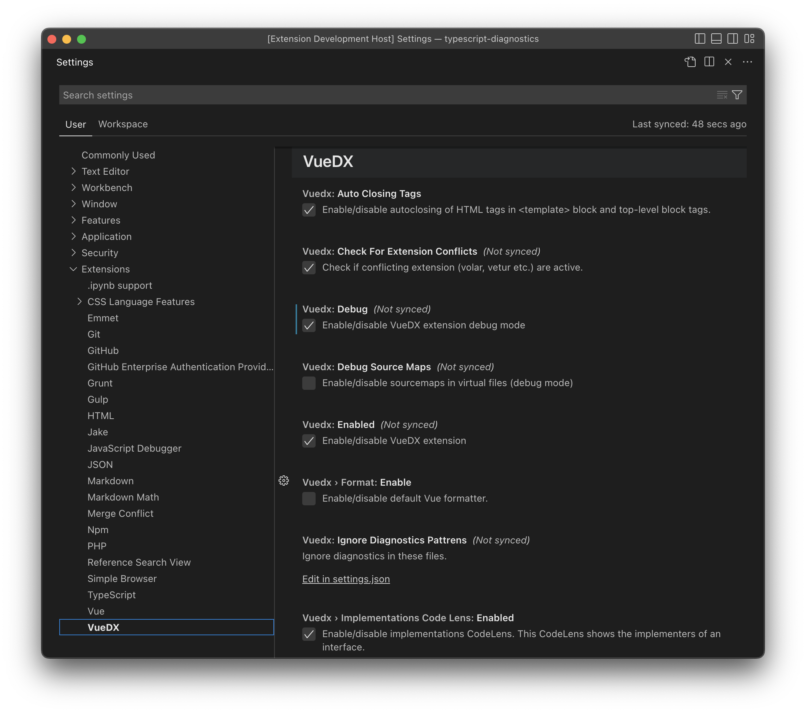

# Configuration

VueDX extension adds a TypeScript plugin to support Vue support in the built-in TypeScript Language Features extension. The TypeScript plugin options are configurable from Visual Studio Code preferences.

## Project Preferences

Add `vueconfig.json` to configure stylistic choices, like using shorthand vs longhand syntax for directives.
