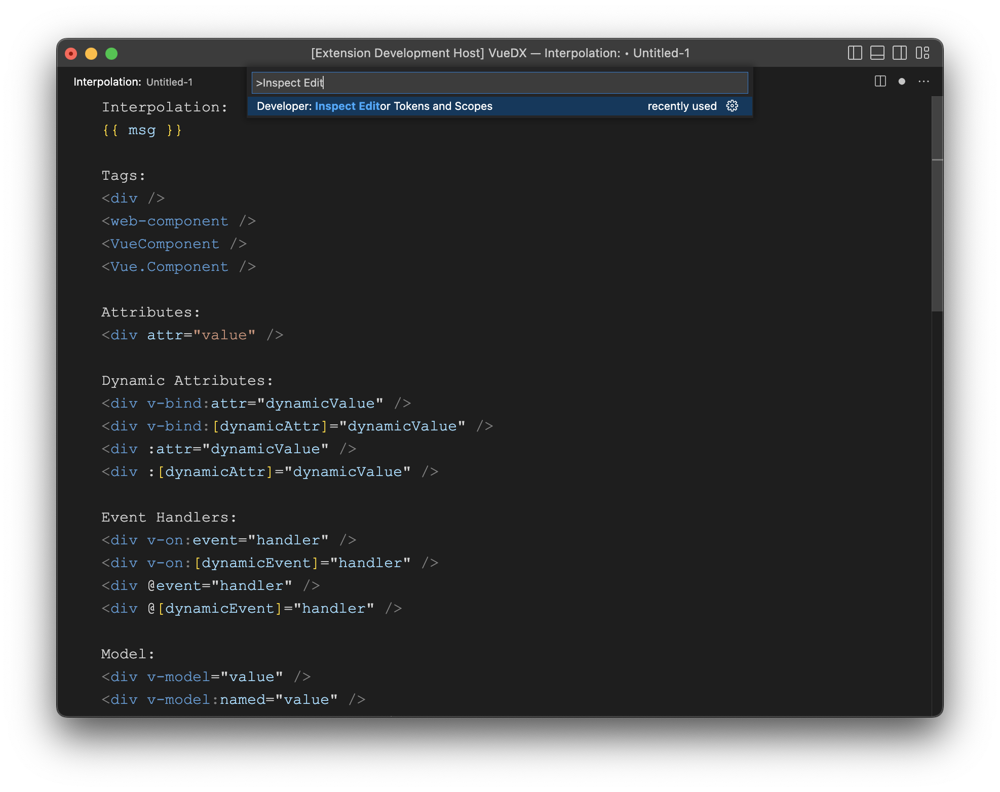
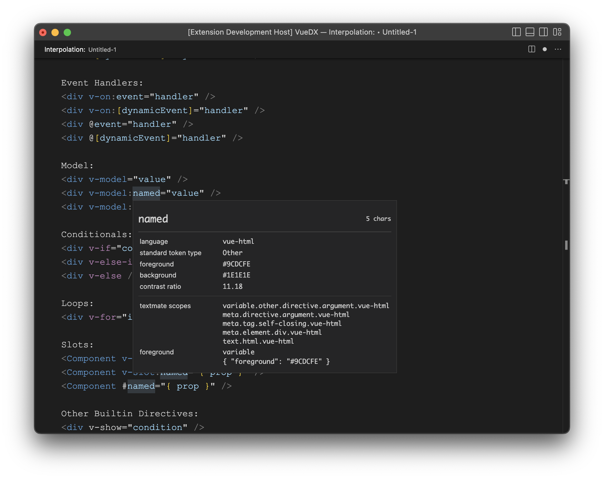
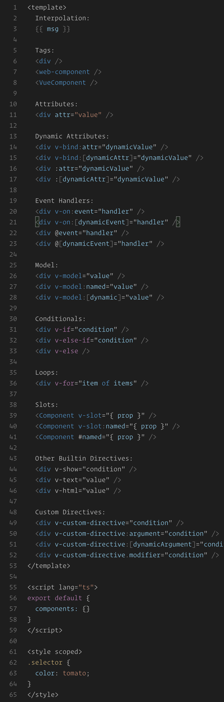
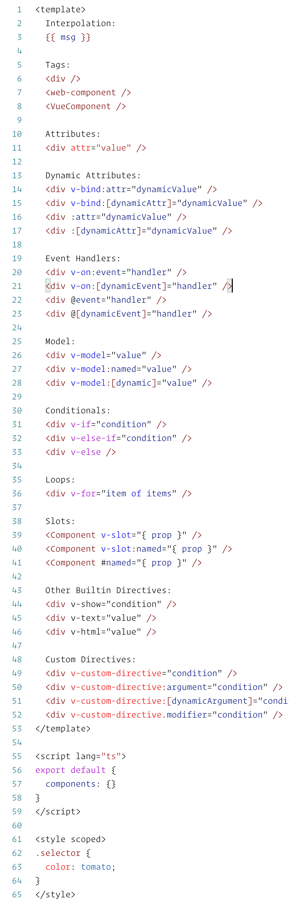
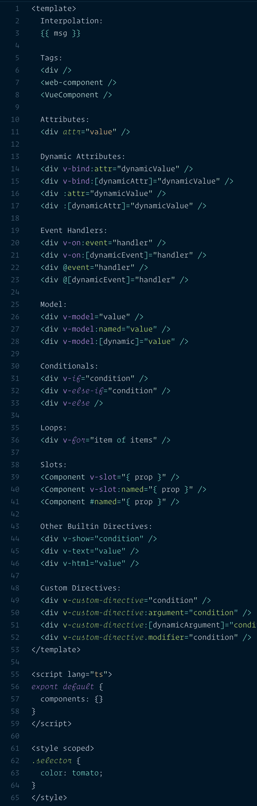
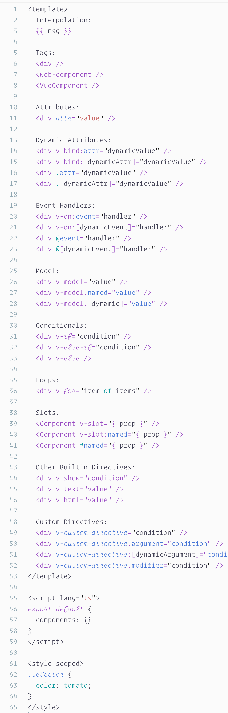

# Creating VS Code Themes

Use editor tokens and scope inspector built-in VS Code to see the syntax information.

## Additional Metadata

The TextMate grammar is defined in [extensions/vscode-vue/syntaxes/markdown-vue-html.tmLanguage.yml](https://github.com/vuedx/languagetools/blob/main/extensions/vscode-vue/syntaxes/markdown-vue-html.tmLanguage.yml). This grammar definition follows [TextMate guidelines](https://macromates.com/manual/en/language_grammars) and naming conventions. Additional metadata is provided using tokens named `meta.*.vue-html`.

## Element Metadata

- `meta.element.<tag name>.vue-html` - Element tag, e.g., `
...
`
- `meta.tag.self-closing.vue-html` - Self-closing tag, e.g., ``
- `meta.tag.open.vue-html` - Opening tag, e.g., `
`
- `meta.tag.close.vue-html` - Closing tag, e.g., `
`

## Attribute Metadata

- `meta.attribute.<attribute name>.vue-html` - Attribute, e.g., `id="..."`

## Directive Metadata

- `meta.directive.<directive name>.vue-html` - Directive, e.g., `v-for="..."`
- `meta.directive.<directive name>.shorthand.vue-html` - Directive attribute, e.g., `@click="..."`, `:class="..."`, or `#default="..."`
- `meta.directive-argument.vue-html` - Directive attribute, e.g., `class` in `v-bind:class="..."`, or `eventName` in `v-on:[eventName]="..."`
- `meta.directive-modifier.vue-html` - Directive modifier, e.g., `prevent` in `v-on:click.prevent="..."`

## Interpolation Metadata

- `meta.interpolation.vue-html` - Interpolation, e.g., `{{ ... }}`
- `meta.embedded.source.expression.ts` - Any javascript/typescript expression

## Theme Previews

### Dark+/Light+ Theme

### [Night Owl Theme](https://marketplace.visualstudio.com/items?itemName=sdras.night-owl)

